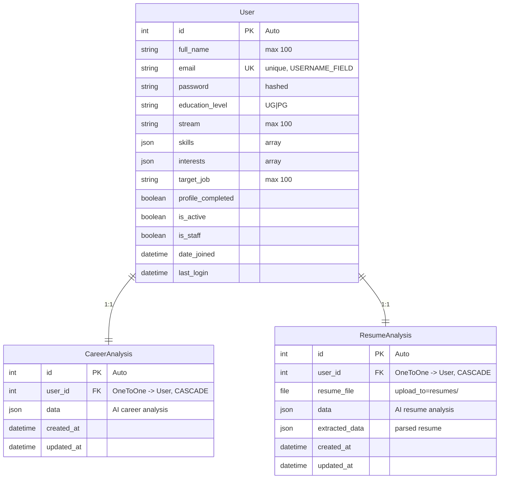

# Sync Project — Entity-Relationship Diagram

The **Sync** project is a career development platform. Its database schema lives in the Django backend (`Sync/accounts/models.py`).

---

## ER Diagram (Mermaid)



---

## Diagram (ASCII)

```
┌─────────────────────────────────────────────────────────────────────────────┐
│                              User                                            │
├─────────────────────────────────────────────────────────────────────────────┤
│ PK  id                    (Auto)                                             │
│     full_name             CharField(100)                                     │
│     email                 EmailField (unique, USERNAME_FIELD)                │
│     password              (hashed)                                           │
│     education_level       CharField(2)  [UG | PG]                            │
│     stream                CharField(100)                                     │
│     skills                JSONField (array)                                  │
│     interests             JSONField (array)                                  │
│     target_job            CharField(100)                                     │
│     profile_completed     Boolean                                            │
│     is_active             Boolean                                            │
│     is_staff              Boolean                                            │
│     date_joined           DateTime                                           │
│     last_login            DateTime                                           │
└────────────┬────────────────────────────────────┬───────────────────────────┘
             │                                    │
             │ 1:1 (CASCADE)                      │ 1:1 (CASCADE)
             ▼                                    ▼
┌─────────────────────────────────┐    ┌──────────────────────────────────────┐
│      CareerAnalysis             │    │         ResumeAnalysis                │
├─────────────────────────────────┤    ├──────────────────────────────────────┤
│ PK  id                          │    │ PK  id                                │
│ FK  user_id  → User             │    │ FK  user_id  → User                   │
│     data       JSONField        │    │     resume_file  FileField (opt)      │
│     created_at DateTime         │    │     data        JSONField             │
│     updated_at DateTime         │    │     extracted_data JSONField (opt)    │
└─────────────────────────────────┘    │     created_at   DateTime             │
                                       │     updated_at   DateTime             │
                                       └──────────────────────────────────────┘
```

---

## Entities

| Entity | Purpose |
|--------|---------|
| **User** | Custom auth model with career profile (education, stream, skills, interests, target job) |
| **CareerAnalysis** | AI-generated career analysis (skill gap, roadmap, dashboard data) |
| **ResumeAnalysis** | AI resume analysis, optional file upload, extracted data |

---

## Relationships

| From | To | Cardinality | Notes |
|------|----|-------------|-------|
| User | CareerAnalysis | 1:1 | Each user has at most one career analysis |
| User | ResumeAnalysis | 1:1 | Each user has at most one resume analysis |

Both `CareerAnalysis` and `ResumeAnalysis` use `on_delete=CASCADE` with `User`.
